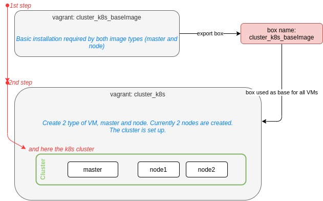

# Vagrant k8s cluster

The project let you to create a kubernetes cluster with vagrant, on your local machine.

Currently, I tested just only virtual box as provider for vagrant.

## Motivation
Whan I started learning kubernetes, I wanted to install it from scratch, manage it and face all the problem coming from installation and maintenance. So, I started using vagrant.
Today, this repository is still useful in some circumstances.

## How to start
You can just rely on the bash file *recreateK8sCluster.sh*

## How does it works
Currently, 2 nodes are created: one master and 2 nodes.

The process starts from the creation of a vagrant box that is then used as starting point for the others VMs.

